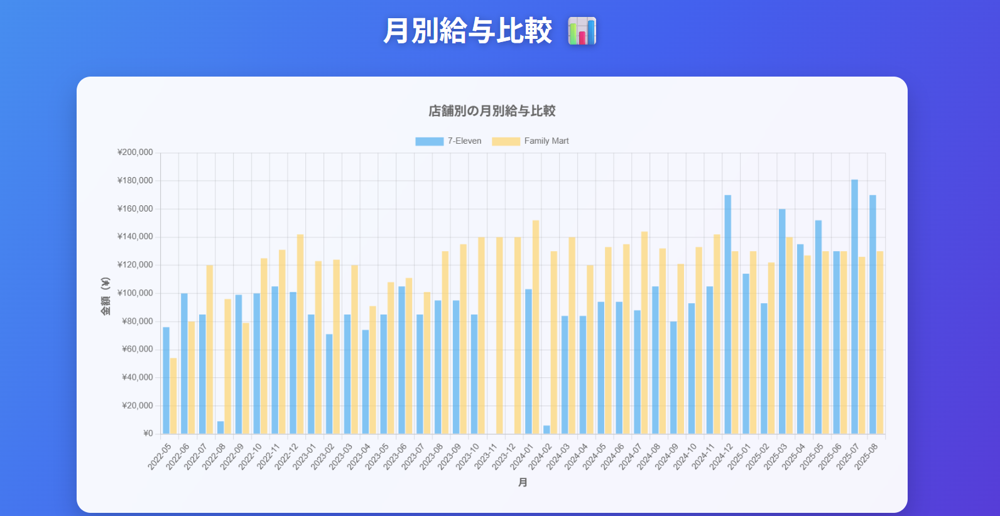
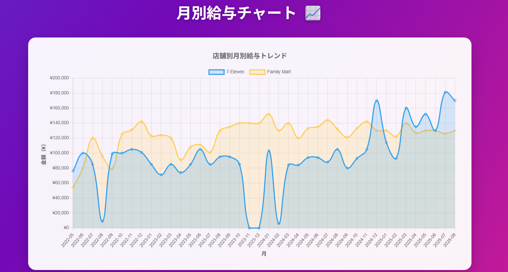
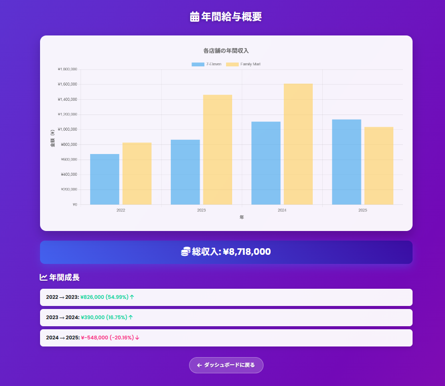

# 給与トラッカー (Salary Tracker)

日本語対応の給与情報を追跡・管理するウェブアプリケーションです。

## ライブデモ

🌐 **アプリケーションはこちら:** https://241033.daa.jp/salary_jap/auth/login.php

## スクリーンショット

### ログインページ

*安全なユーザー認証*

### 登録ページ

*新規ユーザー登録フォーム*

### ダッシュボード

*ナビゲーションカード付きメインダッシュボード*

### 給与を追加

*新しい給与記録を追加するフォーム*

### 給与の閲覧

*すべての給与記録のリスト*

### 給与チャート

*インタラクティブなチャートと視覚化*

### 月別チャート

*月別トレンド分析*

### 年間サマリー

*年間財務レポート*

## 機能

- ユーザー登録とログイン
- 新しい給与記録の追加
- すべての給与記録の閲覧と管理
- インタラクティブな給与チャート
- 月別分析
- 年間サマリーレポート
- 安全なログアウト

## 必要な環境

- PHP 7.4以上
- MySQL/MariaDBデータベース
- Webサーバー（Apache/Nginx）
- モダンなWebブラウザ

## データベース構造

アプリケーションは2つの主要なテーブルを使用します：

### ユーザーテーブル
```sql
CREATE TABLE `users` (
  `id` int(11) NOT NULL AUTO_INCREMENT,
  `name` varchar(100) DEFAULT NULL,
  `email` varchar(100) DEFAULT NULL,
  `password` varchar(255) DEFAULT NULL,
  `created_at` timestamp NOT NULL DEFAULT current_timestamp(),
  PRIMARY KEY (`id`),
  UNIQUE KEY `email` (`email`)
) ENGINE=InnoDB DEFAULT CHARSET=utf8mb4 COLLATE=utf8mb4_general_ci;
```

### 給与テーブル
```sql
CREATE TABLE `salaries` (
  `id` int(11) NOT NULL AUTO_INCREMENT,
  `user_id` int(11) DEFAULT NULL,
  `store_name` varchar(100) DEFAULT NULL,
  `amount` int(11) DEFAULT NULL,
  `received_date` date DEFAULT NULL,
  `working_month` date DEFAULT NULL,
  `notes` text DEFAULT NULL,
  `created_at` timestamp NOT NULL DEFAULT current_timestamp(),
  PRIMARY KEY (`id`),
  KEY `user_id` (`user_id`)
) ENGINE=InnoDB DEFAULT CHARSET=utf8mb4 COLLATE=utf8mb4_general_ci;
```

## インストール方法

1. **プロジェクトファイルをダウンロード**

2. **MySQLデータベースを作成:**
   ```sql
   CREATE DATABASE LAA1619181_mydb;
   ```

3. **データベーステーブルをインポート:**
   - 上記の`users`と`salaries`テーブルのSQLスクリプトを実行

4. **データベース接続を設定** `config/db.php`で:
   ```php
   <?php
   $dbserver = "localhost";        // データベースサーバー
   $dbname = "LAA1619181-mydb";    // データベース名
   $dbuser = "LAA1619181";         // データベースユーザー名
   $dbpasswd = "your_password";    // データベースパスワード

   $opt = [
       PDO::ATTR_ERRMODE => PDO::ERRMODE_EXCEPTION,
       PDO::ATTR_EMULATE_PREPARES => false,
       PDO::MYSQL_ATTR_MULTI_STATEMENTS => false,
   ];

   $pdo = new PDO('mysql:host=' . $dbserver . ';dbname=' . $dbname, $dbuser, $dbpasswd, $opt);
   ?>
   ```

5. **ファイルをWebサーバーにアップロード**

6. **アプリケーションにアクセス:**
   - 次のURLに移動: `https://241033.daa.jp/salary_jap/auth/login.php`

## ファイル構造

```
salary-tracker-jap/
├── auth/
│   ├── login.php              # ログインページ
│   ├── register.php           # ユーザー登録
│   └── protected.php          # 認証システム
├── config/
│   └── db.php                 # データベース設定
├── includes/
│   ├── footer.php             # フッターコンポーネント
│   └── header.php             # ヘッダーコンポーネント
├── add_salary.php             # 新しい給与記録を追加
├── annual_summary.php         # 年間財務レポート
├── dashboard.php              # メインダッシュボード
├── delete_salary.php          # 給与記録を削除
├── edit_salary.php            # 既存の記録を編集
├── export_csv.php             # CSVにデータをエクスポート
├── import_salary_data.php     # 給与データをインポート
├── logout.php                 # ログアウト機能
├── monthly_chart.php          # 月別トレンド分析
├── salary_charts.php          # インタラクティブなチャート
└── view_salaries.php          # すべての給与記録を閲覧
```

## 使用方法

1. **登録/ログイン:**
   - ログインページにアクセス
   - 新しいアカウントを登録するか、既存の認証情報でログイン

2. **給与を追加:**
   - 「給与を追加」をクリック
   - 店舗名、金額、受取日、勤務月を入力
   - フォームを送信

3. **記録を閲覧:**
   - 「給与の閲覧」をクリック
   - 給与記録の閲覧、編集、削除

4. **チャートを表示:**
   - 「給与チャート」をクリックして視覚化
   - 「月別チャート」で月別トレンドを確認
   - 「年間サマリー」で年間レポートを確認

5. **ログアウト:**
   - 終了時に「ログアウト」をクリック

## 使用技術

- **バックエンド:** PHP
- **データベース:** MySQL/MariaDB
- **フロントエンド:** HTML5, CSS3, JavaScript
- **CSSフレームワーク:** Bootstrap 5
- **JavaScriptライブラリ:** jQuery
- **アイコン:** Font Awesome
- **アニメーション:** Animate.css

## セキュリティ機能

- PHPの`password_hash()`を使用したパスワードハッシュ化
- セッションベースの認証
- 保護されたページ（ログイン必須）
- SQLインジェクション防止

## ブラウザサポート

- Chrome
- Firefox
- Safari
- Edge

## ライセンス

MITライセンス

## 作成者

**ポーデル　マノジュ　クマール** (Paudel Manoj Kumar)

- GitHub: [@manojpoudel9256](https://github.com/manojpoudel9256)
- プロジェクトリポジトリ: [給与トラッカー](https://github.com/manojpoudel9256/salary-tracker-jap)

---
